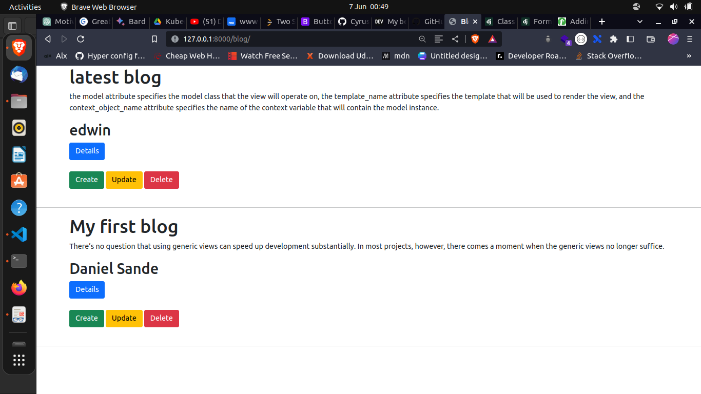
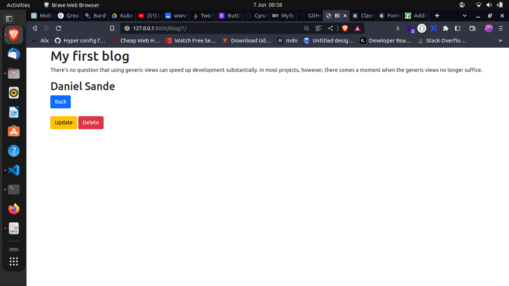

# Django_CRUD_CBVS

## Description
This is repo for a simple blog post.
Main aim to learn CRUD functionalities using Django Class Based Views

## Installation
```
git clone https://github.com/CyrusNchege/Django_CRUD_CBVs
```

```
cd Django_CRUD_CBVs
```

### Create a virtual environment  and acticate environment

#### linux
```
 python3 -m venv env

source env/bin/activate
```
#### windows
```
 python -m venv env

.\env\Scripts\activate

```
#### Install requirement 
```
pip install -r requirements.txt
```
make migrations
```
python manage.py makemigrations
python manage.py migrate
```
 Runserver
```
python manage.py runserver
```
#### Front View
http://127.0.0.1:8000/blog/


#### Detail view
http://127.0.0.1:8000/blog/1/

Detail is a view that displays a single instance of a model.
